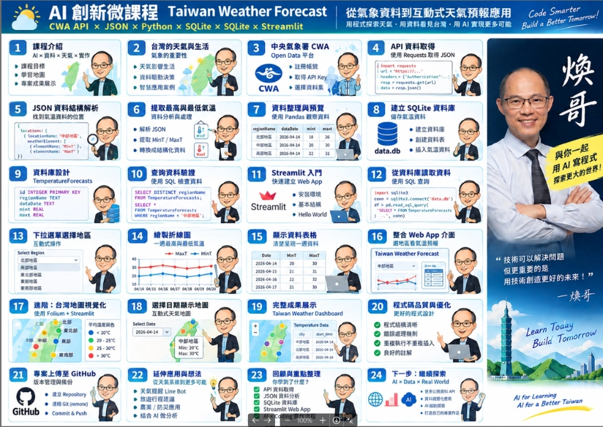
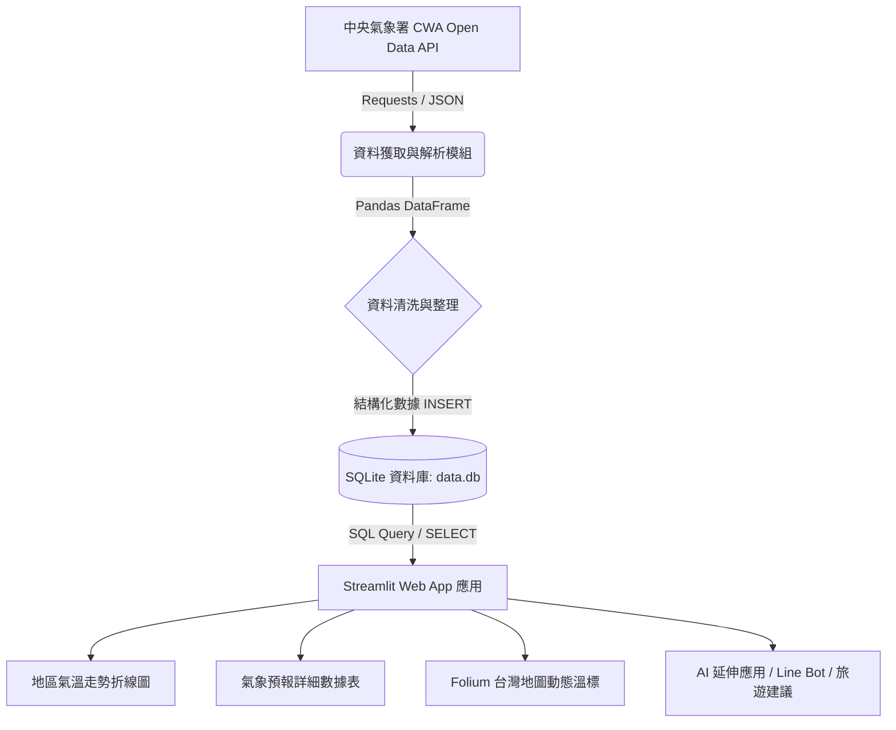

# 🌦️ AI 創新微課程：Taiwan Weather Forecast (台灣互動式天氣預報)

> **從氣象資料到互動式天氣預報應用**  
> *用程式探索天氣 · 用資料看見台灣 · 用 AI 實現更多可能*  
> *Code Smarter, Build a Better Tomorrow!*

---

## 📌 專案簡介
本專案為 AIoT 創新微課程實作專案，整合中央氣象署（CWA）開放資料 API、Python 數據處理、SQLite 輕量級資料庫、以及 Streamlit 現代化 Web 應用框架，打造出一套具備互動圖表與地圖視覺化的全台氣象儀表板（Taiwan Weather Dashboard）。

- **GitHub 專案網址**：[RayWu576/AIoT_L3_CWA_HW1](https://github.com/RayWu576/AIoT_L3_CWA_HW1)
- **核心技術棧**：`CWA Open Data API` × `JSON` × `Python 3` × `Pandas` × `SQLite` × `Streamlit` × `Folium` × `GitHub`

---

## 🗺️ 專案 Workflow 全景學習地圖



---

## 🏗️ 系統資料流架構 (Data Pipeline)



---

## 📋 Workflow 流程深度剖析（6 大階段 · 24 步驟）

整個實作工作流由淺入深分為 **6 大核心階段**，共計 **24 個精實步驟**：

### 階段一：概念引導與環境準備 (Steps 1 ~ 3)
1. **步驟 01｜課程介紹（AI × 資料 × 天氣 × 實作）**
   - 確立專案目標與學習地圖，了解全案最終交付之天氣儀表板成果。
2. **步驟 02｜台灣的天氣與生活（氣象的重要性）**
   - 探討氣象變化對日常生活、交通與產業決策的影響，啟發以「數據驅動」解決問題的思維。
3. **步驟 03｜中央氣象署 CWA Open Data 平台**
   - 註冊中央氣象署開放資料平台會員，申請個人專屬 `API Authorization Key`，並挑選所需的一週預報資料集。

---

### 階段二：API 串接與資料解析處理 (Steps 4 ~ 7)
4. **步驟 04｜API 資料取得（使用 Requests 取得 JSON）**
   - 使用 Python 的 `requests` 模組攜帶授權 Header 向 CWA 終端端點發送 GET 請求，擷取即時天氣 JSON 資料。
5. **步驟 05｜JSON 資料結構解析（定位目標資料）**
   - 剖析多層巢狀 JSON 樹狀結構，精準定位各地區（`locations -> locationName`）及氣象要素（`weatherElement`）。
6. **步驟 06｜提取最高與最低氣溫（資料分析與萃取）**
   - 篩選 `MinT`（最低氣溫）與 `MaxT`（最高氣溫）之時間序列數值，將非結構化文字清洗為數值型資料。
7. **步驟 07｜資料整理與預覽（Pandas DataFrame）**
   - 運用 `pandas` 整理為結構化表格（欄位包含：`regionName`, `dataDate`, `minT`, `maxT`），方便後續分析與寫入。

---

### 階段三：資料庫架構設計與持久化 (Steps 8 ~ 10)
8. **步驟 08｜建立 SQLite 資料庫（儲存氣溫資料）**
   - 使用 Python 內建 `sqlite3` 連線至本地 `data.db`，建立持久化儲存機制，免除重複請求 API 的頻寬消耗。
9. **步驟 09｜資料庫結構設計（TemperatureForecasts）**
   - 規範關聯式資料表結構：
     ```sql
     CREATE TABLE IF NOT EXISTS TemperatureForecasts (
         id INTEGER PRIMARY KEY AUTOINCREMENT,
         regionName TEXT,
         dataDate TEXT,
         minT REAL,
         maxT REAL
     );
     ```
10. **步驟 10｜查詢資料驗證（SQL 檢驗）**
    - 撰寫標準 SQL 語法驗證資料寫入正確性（如：`SELECT DISTINCT regionName ...` 及特定分區過濾查詢）。

---

### 階段四：互動式 Web 應用程式開發 (Steps 11 ~ 16)
11. **步驟 11｜Streamlit 入門（快速建立 Web App）**
    - 掌握 Streamlit 輕量化、即時重載特性，免撰寫前端 HTML/CSS 即可架設 Python 原生 Web App。
12. **步驟 12｜從資料庫讀取資料（SQL 查詢整合）**
    - 利用 `sqlite3` 與 `pd.read_sql_query` 將本地 `data.db` 資料即時渲染至 Web 介面。
13. **步驟 13｜下拉選單選擇地區（互動式操作）**
    - 建立 `st.selectbox` 地區篩選器（北部地區、中部地區、南部地區、東北部地區等），提供直觀的用戶操作。
14. **步驟 14｜繪製折線圖（一週高低氣溫趨勢）**
    - 繪製一週氣溫走勢圖，紅色線標示最高溫（MaxT）、藍色線標示最低溫（MinT），視覺化溫差起伏。
15. **步驟 15｜顯示資料表格（詳細明細檢視）**
    - 以簡潔明瞭的資料清單呈現每日氣溫數據，滿足數值檢視需求。
16. **步驟 16｜整合 Web App 介面（綜合儀表板佈局）**
    - 合併選單、趨勢圖與資料表，建構出專業、響應式的氣象預報網頁界面。

---

### 階段五：進階地圖視覺化與系統品質優化 (Steps 17 ~ 20)
17. **步驟 17｜進階：台灣地圖視覺化（Folium + Streamlit）**
    - 結合 `folium` 繪製台灣地理座標地圖，並根據平均氣溫進行色階區分：
      - 🔵 `< 20°C`：寒冷 / 涼爽
      - 🟢 `20 - 25°C`：舒適宜人
      - 🟠 `25 - 30°C`：溫暖 / 微熱
      - 🔴 `> 30°C`：炎熱高溫
18. **步驟 18｜選擇日期顯示地圖（時空維度動態聯動）**
    - 引入日期挑選器（Date Picker），動態切換指定日期的全台各區 Min/Max 氣溫標記。
19. **步驟 19｜完整成果展示（Taiwan Weather Dashboard）**
    - 整合指標卡片（Metric Cards）、地圖與趨勢圖表，完成一站式互動氣象儀表板。
20. **步驟 20｜程式碼品質與工程化優化**
    - 落實軟體工程最佳實踐：
      - 模組化設計（API 模組、資料庫模組、介面模組分立）
      - 完善的異常攔截與錯誤容錯機制（Try-Except）
      - 避免重複插入（Idempotency 冪等性處理）
      - 乾淨的程式碼註解與說明文件

---

### 階段六：版本管理、部署與未來延伸 (Steps 21 ~ 24)
21. **步驟 21｜專案上傳至 GitHub（版本管理與備份）**
    - 建立 Git 儲存庫、關聯遠端倉庫，落實正規的 `commit` 與 `push` 工作流。
22. **步驟 22｜延伸應用與多元場景拓展**
    - 結合氣象數據發展多元服務：
      - 結合 Line Bot 發送出門攜帶雨具/保暖提醒
      - 串接旅遊景點與行程推薦
      - 智慧農業灌溉與災害早期預警
      - 導入 Generative AI 提供當日穿搭或行程決策建議
23. **步驟 23｜回顧與重點整理（核心技能矩陣）**
    - 總結全案所學：API 數據採集、JSON 解析、SQL 資料庫、Streamlit 網頁應用與全端整合。
24. **步驟 24｜下一步：持續探索真實世界（AI × Data × Real World）**
    - 繼續串接更多政府開放資料（Open Data）、探索進階資料科學與 AIoT 邊緣運算，打造個人實力作品集！

---

## 🛠️ 開發環境安裝與快速開始

### 1. 安裝必要套件
```bash
pip install requests pandas streamlit folium streamlit-folium
```

### 2. 設定 CWA API Key
至 [中央氣象署開放資料平台](https://opendata.cwa.gov.tw/) 取得 API Key。

### 3. 執行資料爬取與資料庫建立
```bash
python fetch_data.py
```

### 4. 啟動 Streamlit 氣象儀表板
```bash
streamlit run app.py
```

---

## 🤝 貢獻與開發工作流
- 每次完成功能開發後，請執行以下命令同步至 GitHub：
```bash
git add .
git commit -m "feat: 完成特定模組開發"
git push origin main
```
